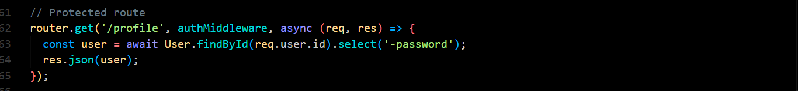
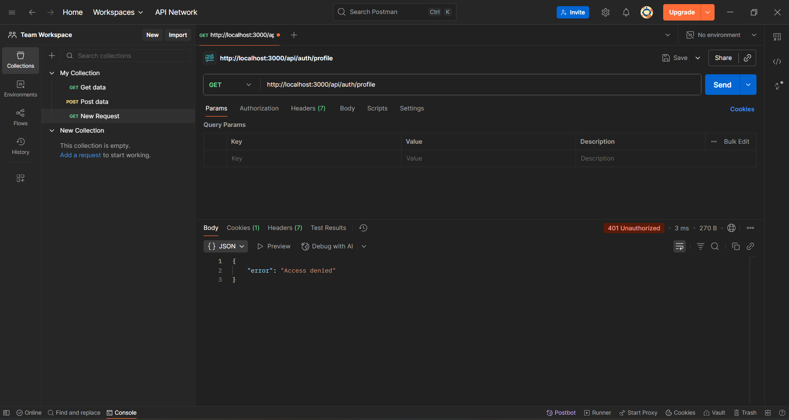
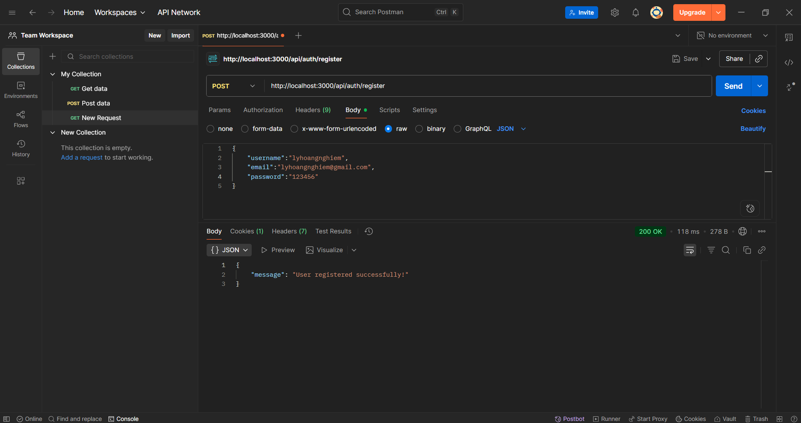
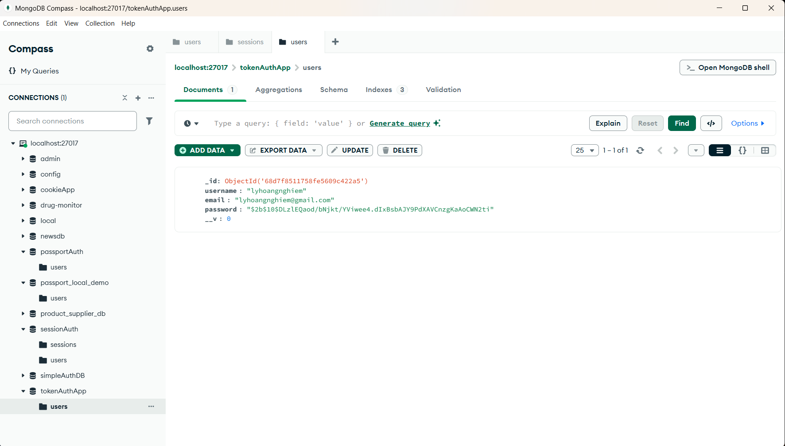
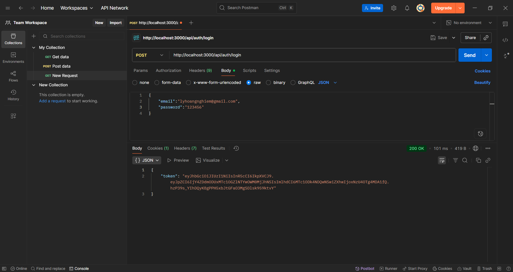
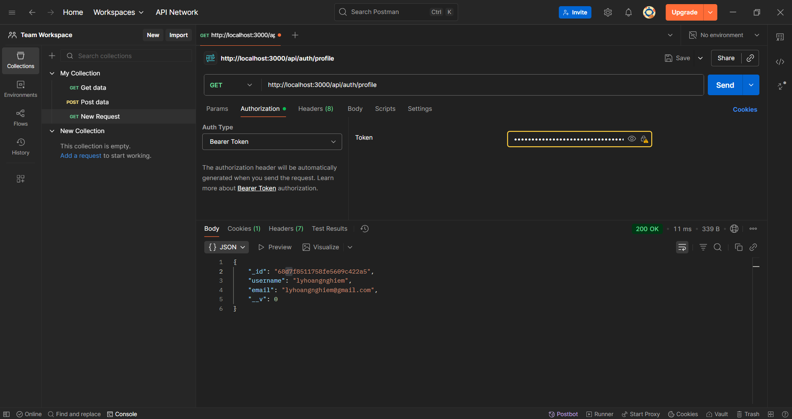

# 🌐 Token Authentication

---

## 📑 Mục lục

- [⚙️ Cài đặt & Chạy dự án](#setup)
- [🅰️ CÂU A – Truy cập `/api/auth/profile` khi chưa có token](#cau-a)
- [🅱️ CÂU B – Đăng ký tài khoản](#cau-b)
- [🅲 CÂU C – Đăng nhập](#cau-c)
- [🅳 CÂU D – Truy cập `/api/auth/profile` với token](#cau-d)

---

## ⚙️ Cài đặt & Chạy dự án <a name="setup"></a>

### 📦 Cài đặt dependencies

```bash
npm install
```

---

## 🅰️ CÂU A <a name="cau-a"></a>

### 🚫 Truy cập `/api/auth/profile` khi chưa có token

- Router này được bảo vệ bởi **middleware check login**.
- Middleware sẽ kiểm tra:

  - Request có kèm token không?
  - Token có hợp lệ không?

📸 Minh họa:


👉 **Kết quả:**


---

## 🅱️ CÂU B <a name="cau-b"></a>

### 📝 Đăng ký tài khoản

📸 Minh họa:


### 🗄️ Kiểm tra database sau khi đăng ký

📸 Minh họa:


---

## 🅲 CÂU C <a name="cau-c"></a>

### 🔑 Đăng nhập

📸 Minh họa:


👉 **Kết quả:**

- Trả về **mã token**.
- Client lưu token này và **gửi kèm trong headers** mỗi request để server xác thực bằng **secret key**.

---

## 🅳 CÂU D <a name="cau-d"></a>

### 👤 Truy cập `/api/auth/profile` với token

- Copy token trả về ở bước đăng nhập.
- Gửi lại token trong **Bearer Token** (Postman).

📸 Minh họa:

